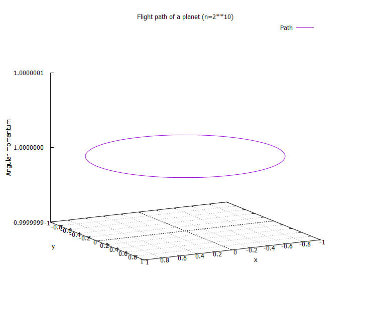

# FortranLesson
大学の講義で作成したFortranのプログラム集です。  
Fortran programs made for my University lessons.

## 3-5
* sum_separately.f90  
Sum separately all odds and evens.
* prime_numbers.f90  
Check if input number is prime or not.
* trapezoidal_rule.f90  
Integrate sin(x) from 0 to pi using Trapezoidal method.
## 6-7
* sqrt_minimum.f90  
Solve sqrt of input number using Newton method.
* nth_root_minimum.f90  
Solve arbitrary root of input number using Newton method.
## 8-10
* inner_product.f90  
Calculate inner product of two matrices loaded from "1d_matrix_data.txt".
* sort_numbers.f90  
Sort numbers loaded from "num_list.txt" and output them into "num_list_output.txt"
* sort_list.f90  
Sort rows according to the numbers located on the left of each row. File is loaded from "list.txt" and output into "list_output.txt"
* analytics.f90  
Calculate average and variance from data loaded from "statistical_data.txt"
## 11-12
* matrix_multiply.f90  
Take an outer product with two matrices loaded from "3d_matrix_data.txt"
* condenser.f90  
Solve Poisson's equation with given initial conditions, to find voltages on other points.
## 13-14
* sort_variables.f90  
Load three variables and sort them in ascending order.
* matrix_multiply2.f90  
Calculate inner product of two arbitrary dimension matrices.
## 15
* euler.f90  
Calculate dy/dx = cos(x) using Euler method.
* runge_kutta.f90  
Calculate dy/dx = cos(x) using Rungekutta method.
## 16-17
There're three versions of programs of each simulation.  
Each differs in using algorithms, Euler method, Leapfrog method, Rungekutta method.
* damped_oscillation  
Calculate how damped oscillation changes with time.  
  
* electromagnetism  
Simulate Rutherford Scattering.  
  
* gravitationa_field  
Simulate how a planet orbits around another planet.  
  
  
## 18
* gauss_jordan_example.f90  
Calculate eigenvalue equation.  
* inverted_matrix.f90  
Calculate inverse of given matrix.
## 19-20
* ls_method.f90  
Find suitable parameters for fitting with given data and function using Least Square method. Given function should be the form of x-series.
## 21-23
* sphere_volume.f90  
Calculate a volume for arbitrary dimension sphere.  
* mc_integrate.f90  
Integrate 6*x*(1-x) from 0 to 1 using Monte Carlo method.
* gauss_rand.f90  
Generate random number using Gaussian distribution